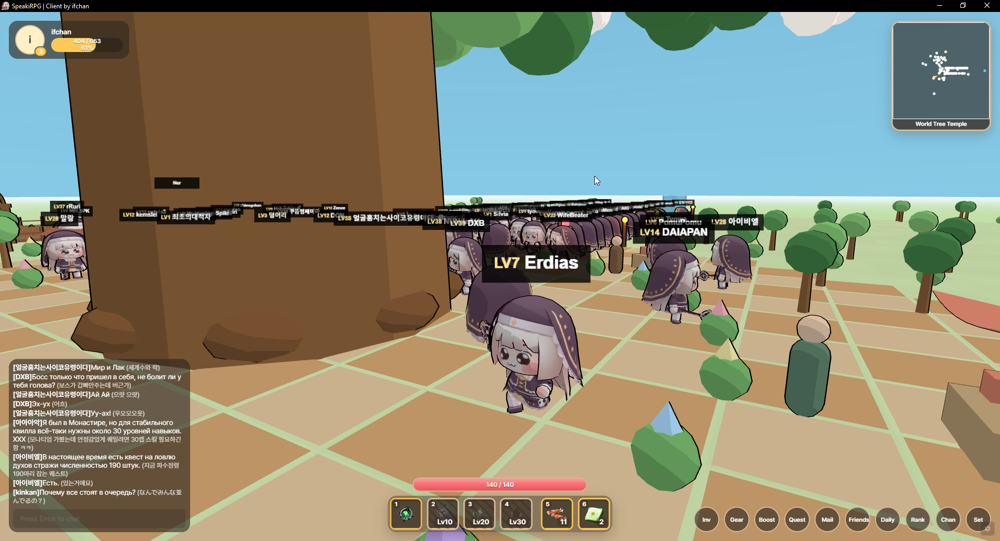
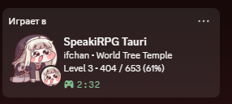
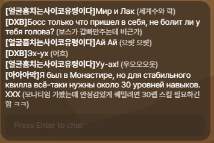
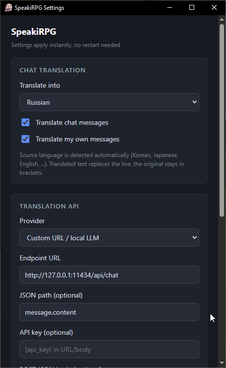

# SpeakiRPG Desktop Client

Tauri desktop client for [Speaki RPG](https://speakirpg.overture.io.kr/): Discord Rich Presence, chat translation, user scripts.

Tauri port of the [original Electron client](https://github.com/DJTOMATO/SpeakiRPG) by [DJTOMATO](https://github.com/DJTOMATO). Fan-made, not affiliated with the game, no game assets included.

## Screenshots






## Install

Releases: [github.com/IffyChan/SpeakiRPG-tauri/releases](https://github.com/IffyChan/SpeakiRPG-tauri/releases)

From source ([Node.js](https://nodejs.org/), [Rust](https://rustup.rs/), [Tauri prerequisites](https://v2.tauri.app/start/prerequisites/)):

```bash
git clone https://github.com/IffyChan/SpeakiRPG-tauri.git
cd SpeakiRPG-tauri
npm install
npm run dev
npm run build    # installer -> src-tauri/target/release/bundle/
```

## Usage

Run the app and log in on the game site (the splash redirects automatically). Discord shows your name, level, XP and location from the character card, ~30s after load and then every 5 min - Discord needs to be running for that to work. Korean/Japanese chat lines get translated in place when you turn it on in Settings, with the original text kept in muted brackets. Toggle with `Ctrl+Shift+T` or from Settings (`Ctrl+Shift+S` / gear button bottom-right).

## Shortcuts

Active while the game window is focused.

- `F5`, `Ctrl+R` (`Cmd+R` on macOS) - reload page
- `Ctrl+Shift+D` - refresh Discord status
- `Ctrl+Shift+T` - toggle chat translation
- `Ctrl+Shift+S` - open settings

## Configuration

Settings window, or edit `settings.json` in the app config dir:

- Windows: `%APPDATA%\com.ifchan.speakirpg\settings.json`
- Linux: `~/.config/com.ifchan.speakirpg/settings.json`
- macOS: `~/Library/Application Support/com.ifchan.speakirpg/settings.json`

| Field | Default | Description |
|-------|---------|-------------|
| `translateTarget` | `"en"` | Target language (ISO code) |
| `translateEnabled` | `false` | Chat translation on/off |
| `translateOwn` | `false` | Translate your own messages |
| `translateProvider` | `"mymemory"` | `mymemory`, `gtx`, or `custom` |
| `translateEndpoint` | `""` | Custom GET/POST URL (`{text}`, `{target}`, `{api_key}`) |
| `translateJsonPath` | `""` | Dot path into JSON response for custom provider |
| `translateApiKey` | `""` | MyMemory email, or `{api_key}` for custom |
| `translatePostBody` | `""` | Optional JSON POST body template for custom |

**Providers**

- `mymemory` - free shared API, optional `translateApiKey` (your email) raises your daily quota.
- `gtx` - unofficial Google endpoint (same as the Chrome widget). Can return HTTP 429.
- `custom` - your own URL or local service (LibreTranslate, Ollama, etc). Example GET: `https://api.mymemory.translated.net/get?q={text}&langpair=autodetect|{target}`. Example POST body for a JSON API: `{"q":"{text}","target":"{target}"}`, with `translateJsonPath` pointing at the result field.

Local SLM setup with Ollama: [English](docs/ollama-translation.en.md) / [Russian](docs/ollama-translation.md).

### Mods

Drop `.js` files into `<config dir>/mods/`. They load after the built-in script, sorted by filename, and each one can be toggled in Settings (reload with F5 to apply). On first run the client copies in the bundled examples (`example-highlight.js`, `example-emotes.js`) if they're not already there.

- API reference: [docs/mods.md](docs/mods.md)
- Porting userscripts / other clients: [docs/adapting-mods.md](docs/adapting-mods.md)

`window.SpeakiRPG` API, quick reference:

| Member | Description |
|--------|-------------|
| `version` | Client version |
| `selectors` | Confirmed `sr-*` CSS selectors |
| `settings` | Client settings snapshot |
| `getStats()` / `getPlayer()` / `getTarget()` / `getDialog()` | HUD snapshots |
| `clickEmoteSlot()` | Click emote hotbar button |
| `query` / `queryAll` | DOM helpers |
| `on('chat', cb)` | `cb({ text, sender, playerId, senderLabel, isMine, isSystem, isEmote }, row)` |
| `on('player', cb)` | `cb({ playerName, level, exp, location, expPercent, needsRevive }, card)` |
| `on('target', cb)` | `cb({ name, hasTarget, isBoss, isBurning, hpText, hpPercent }, frame)` |
| `on('dialog', cb)` | `cb({ open, npcName, text }, dialog)` |
| `on('stats', cb)` | `cb({ playerName, level, exp, location })`, Discord schedule |
| `on('settings', cb)` | `cb(settings)` on change |
| `on('emote', cb)` | chat lines matching the emote heuristic (not **T** / world animation) |
| `translate(text)` | returns a Promise with the translated text |

`on()` returns an unsubscribe function. See [docs/mods.md](docs/mods.md) for details and examples.

### Discord app ID

The default build uses a shared `CLIENT_ID` in `src-tauri/src/main.rs`. For your own release, make an app in the [Discord Developer Portal](https://discord.com/developers/applications) and swap it in.

## License

GPL-3.0, see [LICENSE](LICENSE).
